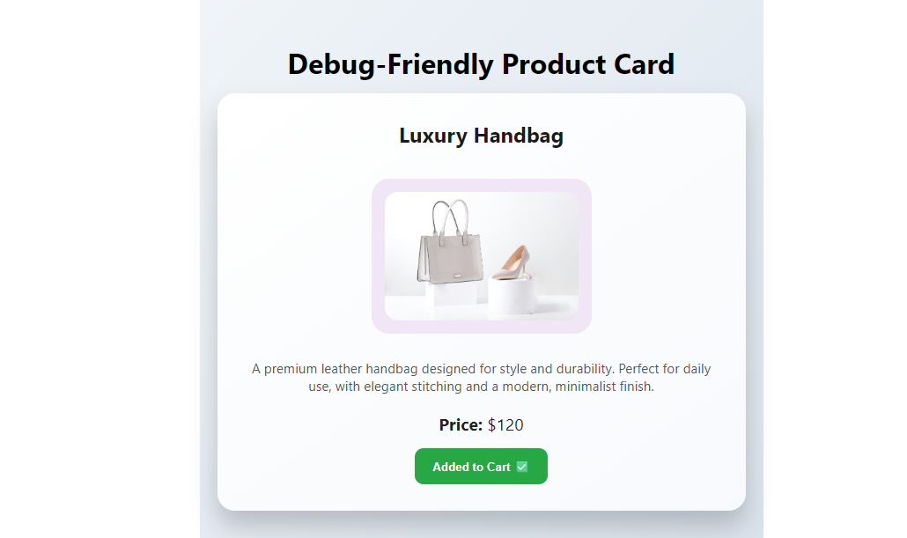

# Debugging Guide for Debug-Friendly Product Card App

This React app contains bugs . Below are common debugging techniques and specific issues in this app.

## General React Debugging Tips

1. **Check the Browser Console**: Open DevTools (F12) and look for error messages, warnings, or console logs.

2. **Use React DevTools**: Install the React Developer Tools browser extension to inspect component trees, props, and state.

3. **Inspect Elements**: Use the Elements tab to see the rendered HTML and CSS.

4. **Network Tab**: Check if assets like images are loading correctly.

5. **Console Logging**: Add `console.log()` statements to track variable values and execution flow.

## Specific Bugs in This App Before Debugging

### 1. Missing Description Prop

- **Issue**: The `ProductCard` component expects a `description` prop, but it's not passed in `App.js`.
- **Symptom**: The description paragraph shows "undefined".
- **Fix**: Pass the description prop: `<ProductCard description="Elegant leather handbag for all occasions." />`

### 2. Incorrect State Type

- **Issue**: `added` state is initialized as string `"false"` instead of boolean `false`.
- **Symptom**: Button always shows "Added to Cart ✅" because string "false" is truthy.
- **Fix**: Change `useState("false")` to `useState(false)` in `ProductCard.js`.

### 3. Incorrect Price Calculation

- **Issue**: Price is set to `120 * 2` which equals 240.
- **Symptom**: Price displays as $240 instead of $120.
- **Fix**: Change `useState(120 * 2)` to `useState(120)` in `ProductCard.js`.

## Debugging Steps

1. Run the app with `npm start`.
2. Open browser to `http://localhost:3000`.
3. Open DevTools and check for console errors.
4. Inspect the ProductCard component in React DevTools.
5. Fix each bug one by one and observe the changes.

## After Debugging

